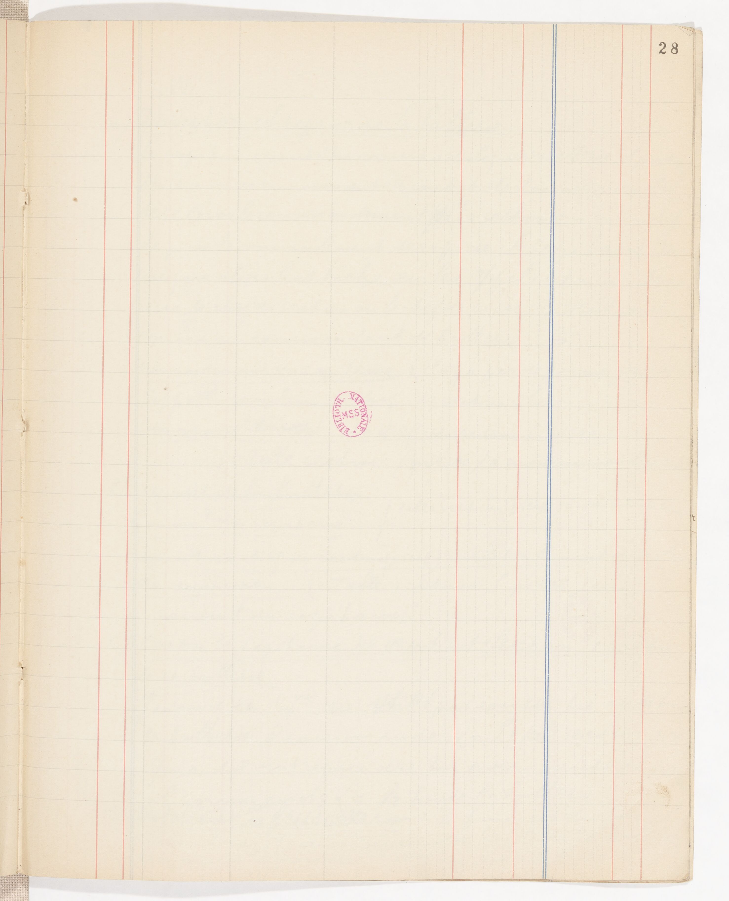
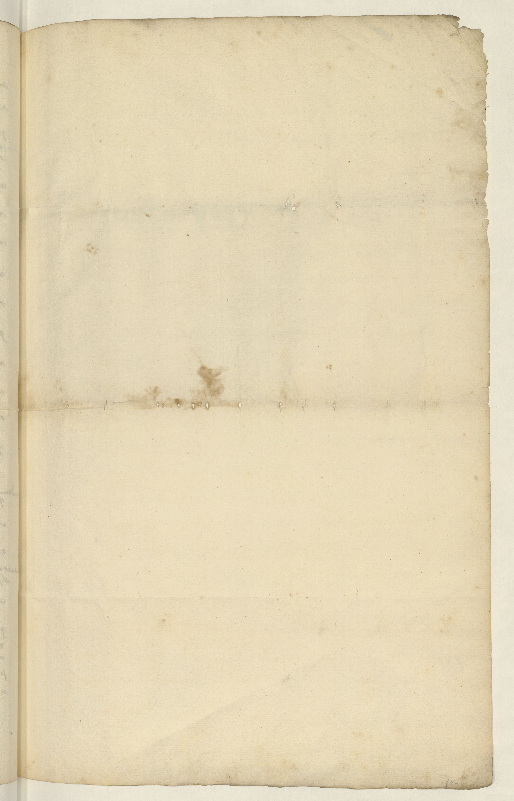

# Gallicalbum

Gallicalbum is a dataset of blank pages taken from manuscripts digitized and distrubuted via the [Gallica web portal](https://gallica.bnf.fr). 

The dataset is distributed in the form of a CSV file listing URL to access the images on the IIIF server offered by Gallica. 

## Download the dataset

In order to download the dataset, you need to:

- clone the repository
- create a Python virtual environnement and install `requests` with pip
- run `python download.py` (Linux syntax)

The `download.py` script will create a directory named `data/` in which we can find all the images composing the Gallicalbum dataset!

A typical series of commands, on Linux, to download the dataset could be:

```sh
$ git clone git@github.com:HugoSchtr/Gallicalbum.git
$ cd Gallicalbum/
$ python -m venv env
$ source env/bin/activate
$ pip install -r requirements.txt
$ python download.py
```

Et voilà!

## Examples of images contained in the dataset

 |  |  | 

## Citation

If you use this dataset, please cite us!

```
@misc{Chague_Gallicalbum_2023,
author = {Chagué, Alix and Scheithauer, Hugo},
month = aug,
title = {{Gallicalbum}},
url = {https://github.com/HugoSchtr/Gallicalbum/},
year = {2023}
}
```

> Chagué, A., & Scheithauer, H. (2023). *Gallicalbum* [Data set]. https://github.com/HugoSchtr/Gallicalbum/


## Any question?

You can contact us by email at hugo.scheithauer[at]inria.fr or alix.chague[at]inria.fr if you have any question or suggestion to improve this dataset.